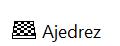
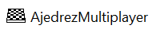

# CHESS-GAME-WIP
Un juego de ajedrez completo desarrollado en Python con Pygame, compilado en archivos ejecutables (`.exe`) para Windows. Cuenta con dos modos de juego independientes: **Partida Local** para dos jugadores en el mismo ordenador, y **Partida Online** para jugar a través de una red LAN (o Internet con configuración avanzada de puertos).

El juego incluye lógica completa de movimiento de piezas, bloqueos, detección de Jaque, Jaque Mate y una interfaz gráfica con piezas generadas mediante Unicode y bordes para un contraste perfecto.


## Características

- **Interfaz Gráfica Atractiva:** Tablero de 8x8 con piezas generadas por sistema (Unicode) y bordes personalizados para mejorar la visibilidad en casillas claras y oscuras.
- **Modo Offline (`ChessOffline`):**
  - Partida local para 2 jugadores en el mismo teclado.
  - **Colores aleatorios:** Asigna aleatoriamente las piezas blancas/negras entre Jugador 1 y Jugador 2 al iniciar.
  - Botón de inicio y gestión de turnos con mensajes en pantalla.
- **Modo Online (`ChessOnline`):**
  - Arquitectura **Cliente-Servidor** mediante Sockets TCP.
  - Uso de **Hilos (Threads)** y colas (`Queue`) para recibir datos sin congelar la ventana del juego.
  - El "Host" de la partida elige aleatoriamente el color de cada jugador y envía la configuración al Cliente.
  - Sincronización de movimientos, capturas y fin de partida (Jaque Mate) en tiempo real.
  - Menú interactivo para introducir la IP del servidor.
- **Lógica de Ajedrez Completa:** 
  - Validación de movimiento de todas las piezas (Rey, Reina, Torre, Alfil, Caballo, Peón).
  - Los peones pueden avanzar 2 casillas en su primer movimiento.
  - Bloqueo de caminos y captura de piezas enemigas.
- Detección de Jaque y Jaque Mate con mensajes personalizados en pantalla.

## Instalación y Ejecución

### Opción 1: Ejecutar los archivos `.exe` (Recomendado)
Si has descargado la versión compilada del juego (o has generado tus propios ejecutables):

1. Ve a la carpeta donde están los archivos `.exe`. (Normalmente suelen estar dentro de una carpeta llamada `dist/` si los compilaste con PyInstaller).
2. Haz doble clic en el archivo que quieras jugar:
   - **`ChessOffline.exe`** → Para jugar en el mismo ordenador (2 jugadores).
   - **`ChessOnline.exe`** → Para jugar por red LAN o Internet.
   *(No necesitas instalar Python ni Pygame para usar esta opción).*

### Opción 2: Ejecutar desde el código fuente (Para desarrolladores)
Si deseas modificar el código o ejecutarlo directamente con Python:

1. Asegúrate de tener Python instalado.
2. Abre una terminal en la carpeta del proyecto.
3. Instala la dependencia necesaria:
```bash
pip install pygame
```
4. Ejecuta el modo que desees:
```bash
python ChessOffline.py
```
**o**
```bash
python ChessOnline.py
```

## ¿Cómo Jugar?

**Modo Local (Ajedrez.exe o ChessOffline.py si eres desarrolador)**
* Al abrir el juego, aparecerá un botón verde "Empezar".

* El sistema asignará aleatoriamente quién juega con blancas y quién con negras.

* Las blancas empiezan siempre. Haz clic en tu pieza y luego en la casilla de destino para moverla.

* La barra inferior te indicará el turno actual y si estás en Jaque.

* Al seleccionar la pieza se te mostrará dependiendo de su movimiento, la casilla a la que puede moverse y se pondrá en amarillo la casilla de la pieza seleccionada. (En el modo online también está implementado).

* Está permitido hacer enroque siempre y cuando no hayan piezas entre la torre y el rey.

* Está permitida la promoción de los peones al llegar al final del tablero, permitiéndote elegir entre reina, caballo, alfil y torre.

* Puedes jugar contra la IA para probar tus habilidades como jugador profesional de ajedrez.

**Modo Online / Red (Ajedrez.exe o ChessOnline.py si eres desarrolador)**
Este modo requiere que dos jugadores ejecuten el programa. Uno será el Host (Jugador 1) y el otro el Cliente (Jugador 2).

**Host (Jugador 1):**

* Ejecuta ChessOnline.exe.

* En el menú, haz clic en "Crear Partida (Host)".

* Opcional: Puedes dejar la casilla de IP vacía (usará 0.0.0.0 y permitirá conectarse en todas las interfaces de red a los demás jugaores) o escribir la IP de tu ordenador (ej. 192.168.1.1 para LAN).

* Esperarás a que el Jugador 2 se conecte. El juego te asignará un color aleatorio.

**Cliente (Jugador 2):**

* Ejecuta ChessOnline.exe.

* En el menú, haz clic en "Unirse a Partida".

* Escribe la IP del ordenador Host (Jugador 1) en la caja de texto.

* Si la conexión es exitosa, el juego también te asigna el color aleatorio y contrario al Jugador 1.

**Dinámica del juego online:**

* El turno se sincroniza automáticamente entre los dos jugadores.

* Cuando muevas una pieza, el movimiento se enviará al oponente y su tablero se actualizará.

* Si logras un Jaque Mate, se enviará una señal de fin de juego y el ganador aparecerá en ambas pantallas.

## Tecnologías Utilizadas
* **Python: Lenguaje de programación principal.**
* **Pygame: Librería para la interfaz gráfica del juego**
* **Sockets y Threading (para el modo Online)**
* **PyInstaller / auto-py-to-exe (para generar los ejecutables `.exe`)**

## Videos de demostración del juego
**Modo Offline**
* Aquí vemos como dos jugadores quedan con solo el caballo del color negro como único superviviente de la partida (esto no puede pasar en el juego real, pero como ven puede llegar a pasar y lo único que habría que hacer es dejar en jaque mate al rey usando técnicas que ustedes conozcan). Presiona la imagen para ver el vídeo demostrativo.

[](https://www.youtube.com/watch?v=3J2V2R2zxgg)

**Modo Online**
* Aquí vemos como el jugador 1 y el 2 se conectan a través de la IP (para demostración usamos 127.0.0.1 para jugar en el mismo computador). Presiona la imagen para ver el vídeo demostrativo.

[](https://www.youtube.com/watch?v=onjQO1FCO-c)

## ¿Dónde ver los cambios recientes?
Consulta el [registro de actualizaciones](CHANGELOG.md) para ver los cambios y mejoras recientes que se hagan durante este tiempo y ponerte al día.

## Contribuir
**¡Las contribuciones son bienvenidas! Para ello:**

* Abre un ISSUE en el repositorio y deja tus sugerencias o ideas de cómo puedo mejorarlo.
* Si no sabes como abrir un ISSUE, contáctame a este correo para las sugerencias o ideas que tengas: "rodriseralarcon98@gmail.com".

##  Licencia y Derechos de Autor
Este proyecto está bajo la Licencia MIT. Puedes usarlo para tu proyecto educativo en tu universidad o instituto en el que estudies. Esto significa que eres libre de usar, copiar, modificar, fusionar, publicar, distribuir, sublicenciar y/o vender copias del software, siempre y cuando se cumplan las siguientes condiciones:

El aviso de derechos de autor y este permiso deben incluirse en todas las copias o partes sustanciales del software.

**Copyright (c) 2026 Rodriu12**